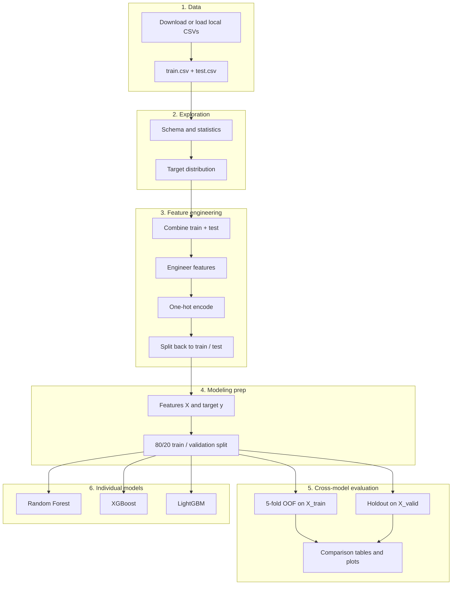
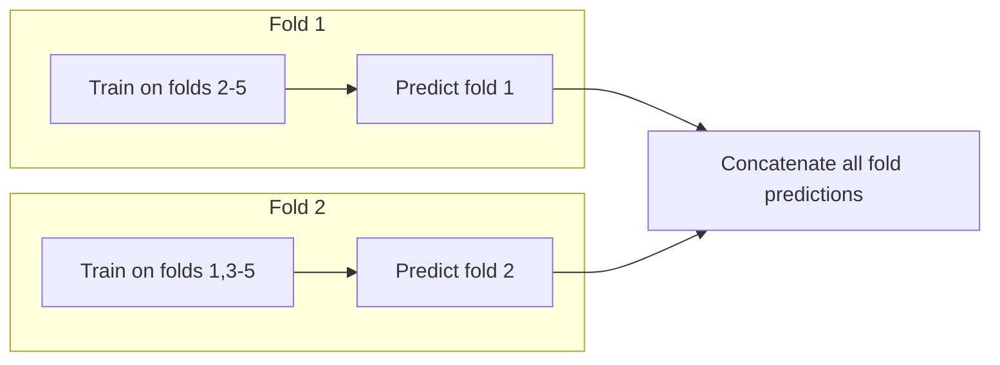

# F1 Pit Stop Prediction — Notebook Code Flow

This document describes the end-to-end flow of [`analysis.ipynb`](analysis.ipynb): what each section does, why it exists, and how data moves through the pipeline.

**Competition:** [Kaggle Playground Series S6E5](https://www.kaggle.com/competitions/playground-series-s6e5)  
**Goal:** Predict `PitNextLap` (will the car pit on the next lap?) — a binary classification problem.

---

## High-level pipeline



---

## How to run the notebook

Run cells **top to bottom**. Later cells depend on variables created earlier (`path`, `train`, `X_train`, `comparison_df`, etc.).

Recommended kernel: project `venv` (F1-kernel).

---

## Phase 1 — Setup and data loading

### Cell 0 — Title (markdown)

Section header: **Importing Data Files**.

---

### Cell 1 — Import libraries

| Library | Role |
|---------|------|
| `kagglehub` | Download competition data from Kaggle |
| `pandas` | Tables and feature matrices |
| `numpy` | Arrays (OOF predictions, plotting) |
| `matplotlib` | Histograms, bar charts, heatmaps |
| `sklearn.model_selection` | `train_test_split`, `StratifiedKFold` |
| `sklearn.ensemble` | `RandomForestClassifier` |
| `sklearn.metrics` | Reports, confusion matrix, precision/recall/F1, ROC-AUC |
| `xgboost` | `XGBClassifier` |
| `lightgbm` | `LGBMClassifier` |

**Output:** No variables yet; loads tools used in all later steps.

---

### Cell 2 — Download competition data

**What it does:**

1. Checks for local files: `./data/train.csv` and `./data/test.csv`.
2. If found → sets `path` to the `data/` folder (offline mode).
3. Otherwise → calls `kagglehub.competition_download("playground-series-s6e5")`.
4. On `UnauthenticatedError` → prints authentication instructions and re-raises.

**Key variable:** `path` — directory containing `train.csv` and `test.csv`.

---

### Cell 3 — Load CSVs

```python
train = pd.read_csv(f"{path}/train.csv")
test  = pd.read_csv(f"{path}/test.csv")
```

**What it does:** Reads labeled training data and unlabeled test data.

**Output:** `train`, `test` DataFrames; prints `train.head()`.

---

## Phase 2 — Exploratory data analysis (EDA)

### Cell 4 — `train.info()`

**What it does:** Shows column names, dtypes, and non-null counts.

**Why:** Confirms schema before modeling (missing values, object vs numeric columns).

---

### Cell 5 — Variable categories (markdown)

Reference table classifying each column:

- **Identifier:** `id` (dropped later)
- **Categorical:** `Driver`, `Compound`, `Race`
- **Numeric / ordinal:** lap, stint, position, lap times, degradation, etc.
- **Target:** `PitNextLap` (0 = no pit next lap, 1 = pit next lap)

**Why:** Guides feature engineering and encoding choices.

---

### Cell 6 — `train.describe()`

**What it does:** Summary statistics for numeric columns (mean, std, min, max, quartiles).

---

### Cell 7 — Target distribution plot

**What it does:**

- Histogram of `PitNextLap` (class 0 vs 1).
- Prints class proportions.

**Why:** The target is **imbalanced** (~80% no pit, ~20% pit). Accuracy alone would be misleading; the notebook later uses class weights and focuses on **precision, recall, and F1 for class 1**.

---

### Cell 8 — Modeling approach (markdown)

Documents the planned strategy:

1. **Imbalance:** `class_weight="balanced"` (RF) and `scale_pos_weight` (XGB/LGBM).
2. **Models:** Random Forest, XGBoost, LightGBM.
3. **Metrics:** Precision, recall, F1, ROC-AUC, confusion matrix — emphasis on catching pit stops (class 1).
4. **Splitting note:** Ideally split by race or time to avoid leakage (current code uses stratified random split on rows).

---

### Cell 9 — `train.describe(include="all")`

**What it does:** Extends `describe()` to categorical columns (counts, unique values, top frequency).

---

## Phase 3 — Feature engineering

### Cell 10 — Build features on combined data

**Strategy:** Concatenate `train` and `test` **before** engineering so both sets get identical transformations. The target `PitNextLap` exists only in train rows.

#### Step-by-step inside the cell

| Step | Code idea | Purpose |
|------|-----------|---------|
| Copy data | `train_fe`, `test_fe` | Preserve raw frames |
| Combine | `pd.concat([train_fe, test_fe])` | Single pipeline for train + test |
| Drop `id` | `drop(columns=["id"])` | ID is not predictive |
| **Tyre features** | `TyreWearCategory`, `TyreLife_Normalized`, `DegPerLap` | Tyre age and wear patterns |
| **Race phase** | `RacePhase`, `LateRace` | Early / mid / late race context |
| **Position** | `PointsZone`, `PodiumPosition`, `Backmarker` | Where the car is on track |
| **Position change** | `LosingPositions`, `GainingPositions`, `LargePositionChange` | Momentum indicators |
| **Stint** | `LateStint`, `LongStintTyres` | Pit strategy signals |
| **Lap time** | Rolling means per driver, `PerformanceDrop`, `SeverePerformanceDrop` | Pace and degradation |
| **Outlier caps** | `clip()` on lap times and degradation | Limit extreme values |
| **Encoding** | `pd.get_dummies(..., drop_first=True)` | Convert categories to numeric columns |

**Output:** `combined` — fully engineered, encoded DataFrame (train rows first, then test rows).

---

### Cell 11 — Section header (markdown)

**Split back to Train/Test result**

---

### Cell 12 — Split combined data back

```python
train_fe = combined.iloc[:len(train)].copy()
test_fe  = combined.iloc[len(train):].copy()
```

**What it does:** Separates engineered train and test sets using original row counts.

**Output:** `train_fe`, `test_fe` with matching feature columns (test has no `PitNextLap` in submission use, but column may still exist from concat — actually train rows have target, test rows from concat would have NaN or same columns; the target is only in train portion of combined before split - need to check if PitNextLap is in test_fe. From cell 15, X drops PitNextLap from train_fe only for modeling. test_fe used for alignment.

---

### Cell 13 — Section header (markdown)

**Separate Features and Target for Model Training**

---

### Cell 14 — Align train and test columns

```python
train_fe, test_fe = train_fe.align(test_fe, join="left", axis=1, fill_value=0)
```

**What it does:** Ensures train and test have the **same columns in the same order**. Missing columns in test are filled with `0` (e.g. rare dummy categories).

**Why:** Required before any future test predictions or consistent feature matrices.

---

## Phase 4 — Train / validation split

### Cell 15 — Build `X`, `y`, and stratified split

```python
X = train_fe.drop(columns=["PitNextLap"])
y = train_fe["PitNextLap"]

X_train, X_valid, y_train, y_valid = train_test_split(
    X, y, test_size=0.2, stratify=y, random_state=42
)
```

| Variable | Description |
|----------|-------------|
| `X` | All features for the full training set |
| `y` | Target labels |
| `X_train`, `y_train` | 80% for fitting models |
| `X_valid`, `y_valid` | 20% holdout for single-split evaluation |

**Why stratify:** Keeps ~same proportion of pit / no-pit in train and valid.

---

## Phase 5 — Out-of-fold (OOF) evaluation (all 3 models)

### Cell 16 — Section header (markdown)

**Out-of-Fold (OOF) Evaluation**

---

### Cell 17 — Model factories and OOF helpers

#### Factory functions

| Function | Model | Imbalance handling |
|----------|-------|-------------------|
| `make_rf()` | Random Forest, 200 trees | `class_weight="balanced"` |
| `make_xgb(y_fold)` | XGBoost | `scale_pos_weight` = ratio of negatives to positives **per fold** |
| `make_lgbm(y_fold)` | LightGBM | Same `scale_pos_weight` logic |

#### `run_oof(model_fn, X, y)`



- Uses **5-fold stratified** `StratifiedKFold` (shuffle, `random_state=42`).
- For each fold: fit on 4/5 of `X_train`, predict the held-out 1/5.
- Returns `oof_pred` — one prediction per training row, each from a model that **did not** see that row during training.

**Why OOF:** More stable estimate of training-set performance than a single split; useful for comparing models fairly.

#### `oof_metrics(y_true, y_pred)`

Returns **Precision**, **Recall**, and **F1** for **class 1** (pit next lap), with `zero_division=0`.

---

### Cell 18 — Run OOF + holdout comparison tables

For each model in `MODEL_CONFIGS`:

1. **OOF path:** `run_oof` → metrics vs `y_train` → `comparison_df`
2. **Holdout path:** fit once on full `X_train` → predict `X_valid` → `holdout_df`

Also stores:

- `oof_preds[name]` — OOF predictions on train
- `holdout_preds[name]` — holdout predictions on valid

| DataFrame | Evaluation type | Data used |
|-----------|-----------------|-----------|
| `comparison_df` | OOF (5-fold CV) | `y_train` + OOF predictions |
| `holdout_df` | Holdout (no OOF) | `y_valid` + single-fit predictions |

**Output:** Printed tables sorted by F1 (descending).

---

## Phase 6 — Visualizations (OOF vs holdout)

### Cell 19 — Section header (markdown)

**Model evaluation visualizations (OOF vs holdout)**

---

### Cell 20 — Grouped bar chart

Three subplots (Precision, Recall, F1). For each model, side-by-side bars:

- **Green** — OOF (5-fold CV on train)
- **Blue** — Holdout (single split on valid)

**Purpose:** Quick visual comparison of whether OOF and holdout rankings agree.

---

### Cell 21 — Heatmaps

Side-by-side color grids of `comparison_df` and `holdout_df` (models × metrics).

**Purpose:** See all nine metric values at a glance.

---

### Cell 22 — F1 focus and delta chart

- Left: F1 bars (OOF vs holdout per model).
- Right: horizontal bars of **OOF F1 − Holdout F1** (green if OOF higher, red if lower).

**Output:** `f1_compare` table displayed at end of cell.

---

### Cell 23 — Confusion matrices (2 × 3 grid)

| Row | Predictions | True labels |
|-----|-------------|-------------|
| Top | OOF on train | `y_train` |
| Bottom | Holdout on valid | `y_valid` |

Columns: Random Forest, XGBoost, LightGBM.

**Purpose:** See false positives / false negatives for each evaluation mode.

---

## Phase 7 — Individual model training (holdout detail)

These sections train **one model at a time** on `X_train` and report detailed sklearn metrics on `X_valid`. They reuse the same factory functions as the OOF section.

---

### Cells 24–26 — Random Forest

| Cell | Action |
|------|--------|
| 24 | Markdown header |
| 25 | `model = make_rf()` → `fit(X_train, y_train)` |
| 26 | Predict `X_valid` → `classification_report`, `confusion_matrix` |

---

### Cells 27–31 — XGBoost

| Cell | Action |
|------|--------|
| 27 | Markdown header |
| 28 | `xgb_model = make_xgb(y_train)` → fit |
| 29 | Predict + probabilities → report, confusion matrix, **ROC-AUC** |
| 30–31 | Top 15 feature importances (horizontal bar chart) |

**ROC-AUC:** Measures ranking quality of predicted probabilities for both classes.

---

### Cells 32–35 — LightGBM

| Cell | Action |
|------|--------|
| 32 | Markdown header |
| 33 | `lgbm_model = make_lgbm(y_train)` → fit |
| 34 | Predict + report + ROC-AUC (same as XGBoost) |
| 35 | Top 10 importances printed + top 15 bar chart |

---

## Key variables reference

| Name | Created in | Meaning |
|------|------------|---------|
| `path` | Cell 2 | Data directory path |
| `train`, `test` | Cell 3 | Raw CSV data |
| `train_fe`, `test_fe` | Cells 10–12 | Engineered features |
| `X`, `y` | Cell 15 | Full train features and target |
| `X_train`, `X_valid`, `y_train`, `y_valid` | Cell 15 | Modeling split |
| `comparison_df` | Cell 18 | OOF metrics (3 models) |
| `holdout_df` | Cell 18 | Holdout metrics (3 models) |
| `oof_preds`, `holdout_preds` | Cell 18 | Per-model prediction arrays |
| `model` | Cell 25 | Fitted Random Forest |
| `xgb_model` | Cell 28 | Fitted XGBoost |
| `lgbm_model` | Cell 33 | Fitted LightGBM |

---

## Evaluation methods compared

| Method | Where in notebook | Trains how many times? | Evaluates on |
|--------|-------------------|------------------------|--------------|
| **OOF (5-fold)** | Cells 17–18, 20–23 | 5 × per model on `X_train` | All train rows (each predicted once out-of-fold) |
| **Holdout** | Cells 18, 20–23, 26, 29, 34 | 1 × per model on `X_train` | `X_valid` (20% held out) |
| **Per-model reports** | Cells 26, 29, 34 | Same as holdout | `X_valid` with full classification report + ROC-AUC (boosting only) |

**Important:** OOF and holdout metrics will **not** match exactly. OOF uses only training data with cross-validation; holdout uses a fixed 20% validation slice.

---

## What is not in the notebook yet

- Predictions on `test_fe` for Kaggle submission
- `submission.csv` export
- Optuna hyperparameter tuning
- Ensemble / stacking of the three models
- Race-level or chronological splitting (noted in markdown but not implemented in code)

---

## Project files

| File | Role |
|------|------|
| [`analysis.ipynb`](analysis.ipynb) | Main notebook (all steps above) |
| [`documentation.md`](documentation.md) | Setup, auth, project overview |
| [`requirements.txt`](requirements.txt) | Python dependencies |
| [`data/`](data/) | Optional local `train.csv` / `test.csv` (gitignored) |
| [`NOTEBOOK_FLOW.md`](NOTEBOOK_FLOW.md) | This flow document |

---

## Suggested reading order for new contributors

1. Cells 0–9 — understand data and imbalance  
2. Cells 10–15 — feature pipeline and split  
3. Cells 16–23 — model comparison (OOF vs holdout)  
4. Cells 24–35 — deep dive on each algorithm and feature importance  
